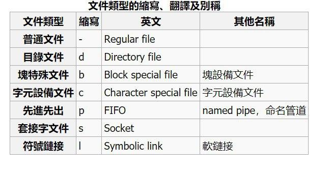

# 上課內容

### 檔名匹配

* `*` 匹配檔名中的任何字串,包括空字串
* `?` 匹配檔名中的任何單個字元
* `[...]` 匹配 [] 中所包含的任何字元
* `[!...]` 匹配 [] 中非驚嘆號 ! 之後的字元

### Linux 目錄

* `/` 根目錄
* `/var` 可變動的東西 ex.httpd, www, email, 系統紀錄擋...
* `/bin` => binary 指令
* `/etc` 放系統在開機過程需要讀取的檔案

  * `/passwd` 存放系統使用者帳號及使用資訊的檔案
  * `/shadow` 真正密碼存放地點
  
* `/sbin` 放系統管理常用的程式如：fdisk, mount
* `/dev` 系統設備目錄，所有設備與裝置都已檔案或目錄方式存在於此目錄
* `/root` 超級使用者家目錄
* `/boot` 開機核心檔案目錄
* `/usr` 套件軟體安裝目錄，類似win的programfiles

### 指令
* `ls -l` 顯示詳細資訊
開頭名稱對應的檔案類型：

* `ls | more` 用頁的方式瀏覽

* `ls | less` 用頁的方式瀏覽，可向前翻頁

* `mkdir / rmdir` 建立 / 刪除檔案

  * `mkdir -p` 若資料夾存在不做任何事情。
  * `rmdir` 只能刪除空白資料夾
  * `rm -f` 強制刪除

* `su -user` 超級使用者切換成 user

* `ls blk` 顯示硬體裝置

* `ls usb` 顯示usb裝置

* `id user` 列出使用者 uid gid group

* 檔案變更指令：

  * `cp` : copy
  * `mv` : move
  * `rm` : remove

# 補充

* vmware 只需要一張NAT網路卡就可以對外通訊
* virtualbox 需要NAT跟Host-only
* linux 並不是只有.exe可以執行，只要有可執行的權限都可以
