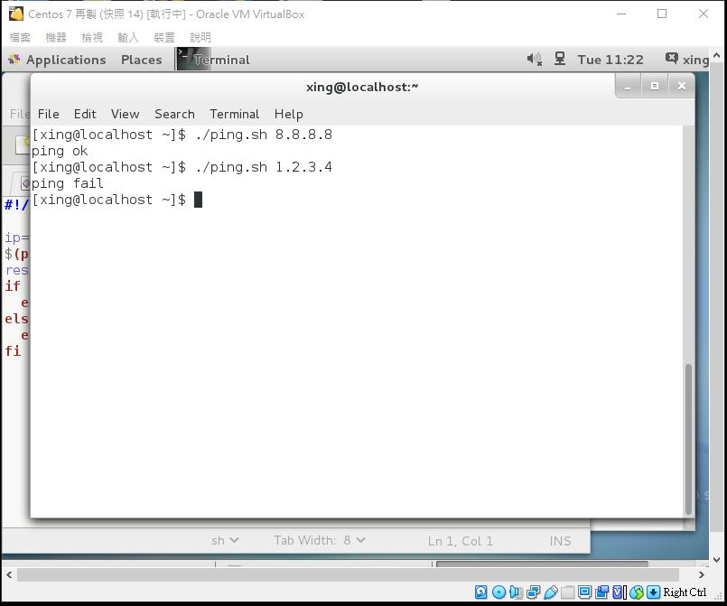

### 指令的輸出入

編號 | 訊息
-----|------
0|標準輸入
1|標準輸出
2|錯誤訊息

* `hello > 1.txt` 把 hello 輸出到 1.txt (會覆蓋掉原本內容)

* `hi >> 1.txt` 附加訊息

* `ls /home &> ouput.txt` "&" = "1, 2" 輸出正確和錯誤訊息到同一個檔案

* `cat < 1.txt` 標準輸入

* `cat 1.txt | tee 4.txt`

* `|` 通道:

  * 前方輸入為後方輸出
  * `wc < 1.txt` "wc" 統計資料 
 
### 搜尋系統

* `which ifconfig` 搜尋 PATH 目錄裡，是否有執行檔

* `whereis ifconfig` 用完整檔名搜尋，獲得檔案位置

* `find` **期末考**:

  * `find /home -name jack` 搜尋 /home 目錄下檔名為 jack 的檔案
  
  * `find /home -iname jack` 不分大小寫
  
  * `find /home -name "*.txt"` "\*" 為通配符號 (0~多個字元.txt)
  
    * [Linux 通配符用法](https://blog.csdn.net/magi1201/article/details/76065370)
  
  * `find . -type f -name a` "-type"為檔案類型 
  
    * f : 檔案
    * d : 資料夾
    
  * `find . ype f -perm 777` "-perm" 為檔案權限 
  
  * `find . -name "*.txt" -type f -exec rm -f {}\; ` "-exec" 找到後執行指令，將搜尋到的檔案放入{ }並刪除
  
  * `find . -tyoe d -empty -exec rmdir {}\; ` 將空資料夾刪除
  
  * `find . -mtime -7 ` 7天內有修改過的檔案
  
  * `find . -size +5M ` 大於 5MB 的檔案
  
# 作業

* ping.sh 腳本測試 ping 的結果，只會顯示成功或失敗

```
chmod +x ping.sh
gedit ping.sh
---------------------------------
# ping.sh 的內容:

#!/usr/bin/bash

ip=$1
$(ping -c 1 -W 1 $ip &> /dev/null)
result=$(echo $?)
if [ $result -eq 0 ]; then
  echo "ping ok"
else
  echo "ping fail"
fi
```



